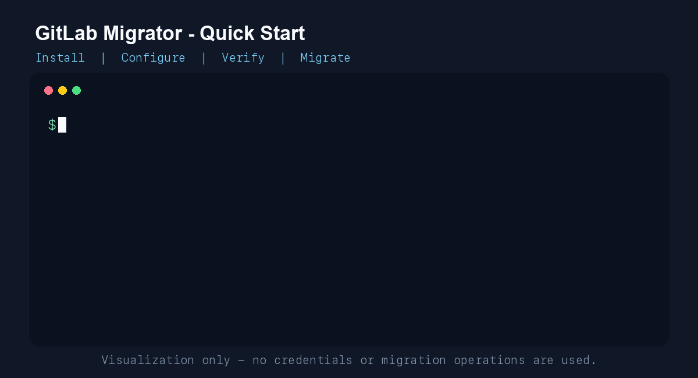

# GitLab Migrator

[](https://github.com/andjoy404/gitlab-migrator/actions/workflows/ci.yml)
[](https://github.com/andjoy404/gitlab-migrator/pkgs/container/gitlab-migrator)
[](LICENSE)

A command-line toolkit for moving repositories and selected operational data between GitLab instances. It supports repository mirrors, recent merge requests, variables, hooks, protection rules, runners, pipeline audit/replay workflows, and container-registry operations.



> Test migrations with a limited group first. Cross-instance APIs cannot preserve every GitLab internal ID, timestamp, event, artifact, or approval.

## Quick start

Install from GitHub:

```bash
pipx install git+https://github.com/andjoy404/gitlab-migrator.git
```

Create local configuration:

```bash
cp .env.example .env
chmod 600 .env
```

Fill these required values:

```dotenv
SOURCE_URL=https://gitlab.example.com
SOURCE_TOKEN=replace-with-source-token
SOURCE_GROUP=source-group
DEST_URL=https://gitlab.destination.example.com
DEST_TOKEN=replace-with-destination-token
DEST_ROOT_GROUP=destination-group
```

Review the detected endpoints and start:

```bash
gitlab-migrator migrate
```

For reviewed automation, bypass only the initial source/destination confirmation:

```bash
gitlab-migrator migrate --yes
```

The default `.env`, `output`, and `workspace` locations are relative to the directory where the command runs. Custom global options must appear before the subcommand:

```bash
gitlab-migrator \
  --env-file /srv/gitlab-migrator/config/.env \
  --output-dir /srv/gitlab-migrator/output \
  --workspace-dir /srv/gitlab-migrator/workspace \
  migrate
```

See [Configuration](docs/configuration.md) for variables, exported locations, filters, and secret handling.

## Commands

Run `gitlab-migrator COMMAND --help` for command-specific options.

| Area | Commands |
| --- | --- |
| Repositories | `migrate`<br>`migrate-merge-requests` |
| GitLab metadata | `migrate-variables`<br>`migrate-group-variables`<br>`migrate-hooks`<br>`migrate-protection` |
| Runners | `export-runners`<br>`deploy-runners`<br>`resume-runners` |
| Pipelines | `export-pipelines`<br>`replay-pipelines`<br>`cancel-pipelines` |
| Registry | `migrate-registry`<br>`set-registry-retention`<br>`purge-registry-images` |

Commands that can remove or cancel data use preview/dry-run behavior unless their help explicitly requires `--execute`. Always review the preview.

## Docker

A ready-to-use image contains Git, Git LFS, OpenSSH, and Skopeo:

```bash
cp docker/.env.example docker/.env
docker compose -f docker/docker-compose.yml pull
docker compose -f docker/docker-compose.yml up -d
docker exec -it gitlab-migrator gitlab-migrator migrate
```

The Compose container is a persistent toolbox and stays running after commands finish. Migrations can instead run as detached jobs with `migrate --yes`, then be monitored through `docker logs -f`. Runner deployment should remain attached because it can require manual SSH choices.

Read [Docker deployment](docs/docker.md) for local builds, GHCR, volumes, detached jobs, logs, and runner keys.

## Documentation

- [Installation and upgrades](docs/installation.md)
- [Configuration and custom locations](docs/configuration.md)
- [Docker deployment](docs/docker.md)
- [Repositories and merge requests](docs/repositories.md)
- [Runners](docs/runners.md)
- [Pipelines](docs/pipelines.md)
- [Container registry](docs/container-registry.md)
- [Changelog](CHANGELOG.md)

Keep practical usage documentation in this repository so it remains versioned with the code. A GitHub blog or external article is useful for architecture stories and migration lessons, but should link back to these guides for current commands.

## Upgrade

```bash
pipx upgrade gitlab-migrator
```

When installing directly from a Git branch, force a refresh if pipx cannot detect a newer published package version:

```bash
pipx install --force git+https://github.com/andjoy404/gitlab-migrator.git
```

## Security

Never commit `.env`, access tokens, SSH keys, generated output, or workspace mirrors. Use minimally scoped tokens, protect configuration permissions, rotate exposed credentials immediately, and verify destination backups before destructive registry or pipeline operations.

## Development

```bash
python3 -m venv .venv
. .venv/bin/activate
pip install -e .
python -m unittest discover -s tests
```

Contributions and focused issue reports are welcome. This project is licensed under the [MIT License](LICENSE).
